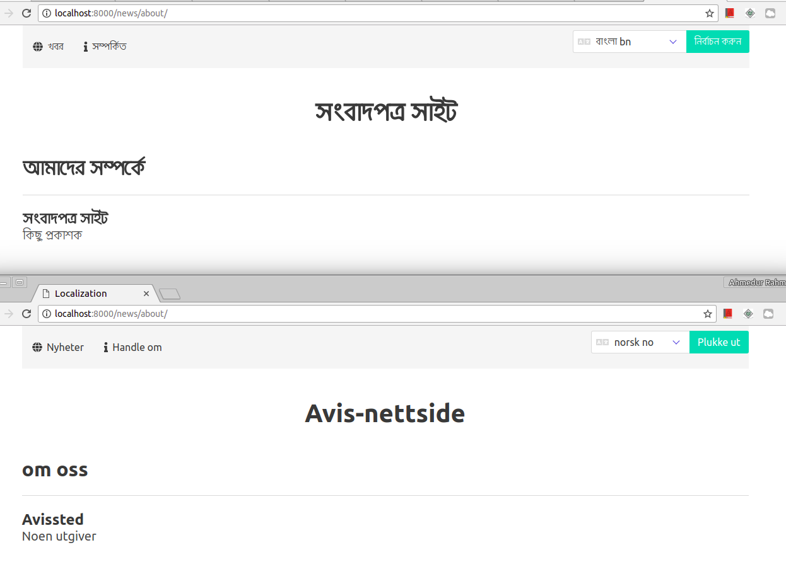

Localization of Django & MySQL Application using Docker (Bonus: PHPMyAdmin)
===========================================================================


### Prerequisite
* Ensure that you already installed Docker in your machine. To learn more about installation: [follow this gist](https://gist.github.com/arsho/6249e3f0fc1d966d115c34718e1a8a0a#file-docker_installation_ubuntu_16-04-md)
* Ensure that you already installed Docker Compose in your machine. To learn more about installation: [follow this gist](https://gist.github.com/arsho/6249e3f0fc1d966d115c34718e1a8a0a#file-docker_compose_ubuntu_16-04-md)

### Environment

* <b> Operating System</b> : Ubuntu 16.04 LTS (64-bit)
* <b> Python (Docker)</b> : 2.7 (64-bit)
* <b> Django (Docker)</b> : 1.8.18


### Running Django app with MySQL database inside Docker
The following steps showed the step by step guideline. 

#### Docker Compose Commands
* In this step we are going to build Docker containers:
    ```
    docker-compose build
    ```
    The execution of the command will take some time based on internet connection speed.
    If you failed to build everything succesfully retry several times as network connection sometimes cause the error.

* Builds, (re)creates, starts, and attaches to containers for a service in daemon mode:
    ```
    docker-compose up -d
    ```

* Stop running containers without removing them:
    ```
    docker-compose stop
    ```

* Stops containers and removes containers, networks, volumes, and images created by `up`:
    ```
    docker-compose down
    ```

* List containers:
    ```
    docker-compose ps
    ```
#### Running Django App
First migrate the database:
```
docker-compose run web python manage.py makemigrations
docker-compose run web python manage.py migrate
```
Then create super user:
```
docker-compose run web python manage.py createsuperuser
```
Finally, run the Django application:
```
docker-compose run web python manage.py runserver
```

### Access the web app

* Web application URL: [http://0.0.0.0:8000/news](http://0.0.0.0:8000/news)

* Access the `PHPMyAdmin`: [http://0.0.0.0:8082/](http://0.0.0.0:8082/)
    
    Use the following credentials:
    ```
    Server: db
    Username: root
    Password: mypassword
    ```
* Admin panel: [http://0.0.0.0:8000/admin](http://0.0.0.0:8000/admin)

### Localization techniques

* In top of the templates use: 
    ```
    
    ```
    And then in templates use like the following string literals or variables:
    ```
    
    ```

* To add the messages in message file of different languages use:
    ```
    docker-compose run web django-admin makemessages -l 'bn
    docker-compose run web django-admin makemessages -l 'no'  
    docker-compose run web django-admin makemessages -d djangojs --locale bn  
    ```
    
* You can also add translation in `JS` files using `gettext()`.
    After adding the translation in `JS` files add the messages in new message file:
    ```
    docker-compose run web django-admin makemessages -d djangojs --locale bn
    ```
    
* Add translation of the messages in the message files:
    ```
    docker_django_localization/locale/no/LC_MESSAGES/django.po
    docker_django_localization/locale/bn/LC_MESSAGES/django.po
    docker_django_localization/locale/bn/LC_MESSAGES/djangojs.po    
    ```

* Compile the messages:
    ```
    docker-compose run web django-admin compilemessages    
    ```

### Special notes about this branch

**This branch use localization based on the domain.**

As you can see the following dictionary in the [settings.py](localization_project/settings.py) file:
```
LANGUAGE_DOMAINS = {
    'localhost:8000': 'bn',
    'localhost:8001': 'no',
    'localhost:8002': 'en'
}
```
It selects the language for the site based on the domain. 
To achieve this we created a custom middleware: [news/middleware.py](news/middleware.py)


In this branch we have no option for user selection of langauge.
#### Referencese
* [Official documentation for translation](https://docs.djangoproject.com/en/1.8/topics/i18n/translation/)
* [Start Django project with Docker](http://mmorejon.github.io/en/blog/start-django-project-with-docker/)
* [Switch language for domain in Django](https://7webpages.com/blog/switch-language-regarding-of-domain-in-django/)